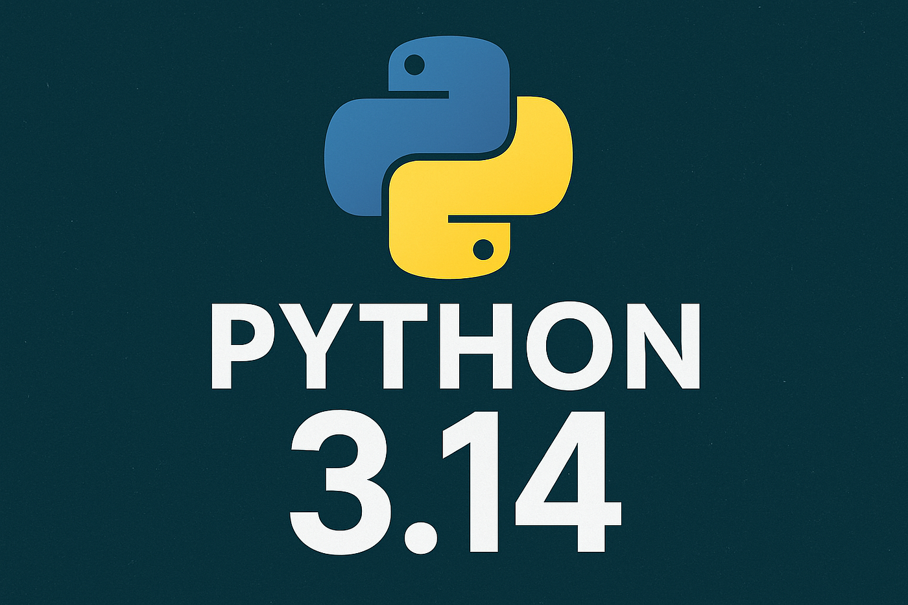

📖 Resolución de las Katas Python 📖

Este proyecto contiene la resolución y documentación de los 41 ejercicios propuestos, demostrando los conocimientos adquiridos durante el desarrollo del módulo.

🗻 Estructura del Proyecto:

-  Enunciados/ # Enuciados crudos
-  img/ # Imágenes usadas para el README.md
-  results/ # archivo ipynb con la resolución de los ejercicios
-  README.md # Descripción del proyecto

Este proyecto no requiere librerías ni dependencias externas.
Para arrancar este proyecto será necesario tener instalado Python, si no no podrá ejecutar las soluciones propuestas.

📖 Próximos Pasos:

Después de haber afianzado los conocimientos aprendidos en este módulo, tengo intención de seguir aprendiendo más sobre Python y tratar de exprimir el máximo potencial de este lenguaje para crear, y mejorar mis propios proyectos.

🤝 Contribuciones

Las contribuciones son bienvenidas. Si deseas mejorar el proyecto, por favor
abre un pull request o una issue.

- Óscar Casanova Herrera
- [@OscarCasahe](https://github.com/OscarCasahe)